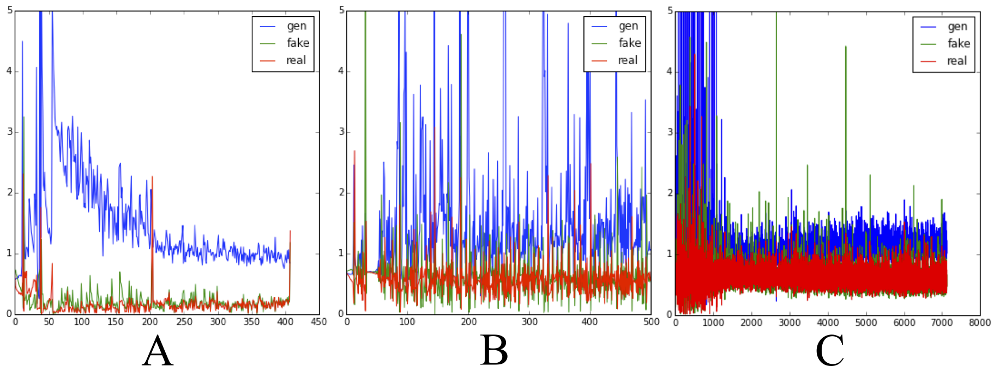

#Generating Faces with Torch
In this blog post we'll implement a generative image model that converts random noise into images of faces!


<p align='center'></p>

For this task, we employ a [Generative Adversarial Network](http://arxiv.org/abs/1406.2661) (GAN) [1].
A GAN has two components; a *generator* which converts random noise into images and a *discriminator* which tries to distinguish between generated and real images. Here, 'real' means that the image came from our training set of images in contrast to the generated fakes.

To train the model we let the discriminator and generator play a game against each other. We first show the discriminator a mixed batch of real images from our training set and of fake images generated by the generator. We then simultaneously optimize the discriminator to answer NO to fake images and YES to real images and optimize the generator to fool the discriminator into believing that the fake images were real. This corresponds to minimizing the classification error wrt. to the discriminator and maximizing it wrt. the generator.
With careful optimization both generator and discriminator will improve and the generator will eventually start to generate convincing images.

### Implementing the GAN
We implement the generator and discriminator as convnets and train them with stochastic gradient descent.

The discriminator is a standard convnet with consecutive blocks of convolution, ReLU activation and max-pooling.

```LUA
model_D = nn.Sequential()
model_D:add(cudnn.SpatialConvolution(3, 32, 5, 5, 1, 1, 2, 2))
model_D:add(cudnn.SpatialMaxPooling(2,2))
model_D:add(cudnn.ReLU(true))
model_D:add(nn.SpatialDropout(0.2))
model_D:add(cudnn.SpatialConvolution(32, 64, 5, 5, 1, 1, 2, 2))
model_D:add(cudnn.SpatialMaxPooling(2,2))
model_D:add(cudnn.ReLU(true))
model_D:add(nn.SpatialDropout(0.2))
model_D:add(cudnn.SpatialConvolution(64, 96, 5, 5, 1, 1, 2, 2))
model_D:add(cudnn.ReLU(true))
model_D:add(cudnn.SpatialMaxPooling(2,2))
model_D:add(nn.SpatialDropout(0.2))
model_D:add(nn.Reshape(8*8*96))
model_D:add(nn.Linear(8*8*96, 1024))
model_D:add(cudnn.ReLU(true))
model_D:add(nn.Dropout())
model_D:add(nn.Linear(1024,1))
model_D:add(nn.Sigmoid())
```
Nothing special here. The discriminator takes a 64x64 RGB image as input and predicts YES or NO with a single sigmoid output.

The generator goes in the opposite direction. We start with a small image which is upsampled and convolved repeatedly:

```LUA
x_input = nn.Identity()()
lg = nn.Linear(opt.noiseDim, 128*8*8)(x_input)
lg = nn.Reshape(128, 8, 8)(lg)
lg = cudnn.ReLU(true)(lg)
lg = nn.SpatialUpSamplingNearest(2)(lg)
lg = cudnn.SpatialConvolution(128, 256, 5, 5, 1, 1, 2, 2)(lg)
lg = nn.SpatialBatchNormalization(256)(lg)
lg = cudnn.ReLU(true)(lg)
lg = nn.SpatialUpSamplingNearest(2)(lg)
lg = cudnn.SpatialConvolution(256, 256, 5, 5, 1, 1, 2, 2)(lg)
lg = nn.SpatialBatchNormalization(256)(lg)
lg = cudnn.ReLU(true)(lg)
lg = nn.SpatialUpSamplingNearest(2)(lg)
lg = cudnn.SpatialConvolution(256, 128, 5, 5, 1, 1, 2, 2)(lg)
lg = nn.SpatialBatchNormalization(128)(lg)
lg = cudnn.ReLU(true)(lg)
lg = cudnn.SpatialConvolution(128, 3, 3, 3, 1, 1, 1, 1)(lg)
model_G = nn.gModule({x_input}, {lg})
```

To generate an image we feed the generator with noise distributed N(0,1). After training, the output will be an image (hopefully)!

```LUA
local noise_inputs = torch.Tensor(N, opt.noiseDim)
noise_inputs:normal(0, 1)
local samples = model_G:forward(noise_inputs)
```

### Balancing the GAN game
In principle, the GAN optimization game is simple. We use binary cross entropy to optimize the parameters in the discriminator. Afterwards we use binary cross entropy to optimize the generator to fool the discriminator. However, you often find yourself left with not so convincing outputs from generator:


<p align='center'></p>

This gibberish is typical for a generator trained without proper care!

A couple of tricks are necessary to facilitate training: First of, we need to make sure that that neither the generator nor the discriminator becomes too good compared to the other. If the discriminator wins and classifies all images correctly, the error signal will be poor and the generator will not be able to learn from it. Conversely, if we allow the generator to win, it is usually exploiting a non-meaningful weakness in the discriminator (e.g. by coloring the entire image blue) which is not desirable.

We monitor the training by plotting three quantities:

  1. How good the generator is at at fooling the discriminator (gen)
  2. How good the discriminator is at classifying fakes as fakes (fake)
  3. how good the discriminator is at classifying real images as real (real)

Below we plot these quantities for three different trainings.
In panel A) we have batch normalization in the discriminator. The training does never converge because the discriminator is too good. In this case the sigmoid saturate and the generator will have no gradient.

To alleviate the problem, we monitor how good the discriminator is at classifying real and fake images and how good the generator is at fooling the discriminator. If one of the networks is too good, we skip updating its parameters. This is shown in panel B). We also removed batch normalization from the discriminator.

```LUA
local margin = 0.3
     sgdState_D.optimize = true
     sgdState_G.optimize = true
if err_F < margin or err_R < margin then
     sgdState_D.optimize = false
end
if err_F > (1.0-margin) or err_R > (1.0-margin) then
     sgdState_G.optimize = false
end
if sgdState_G.optimize == false and sgdState_D.optimize == false then
     sgdState_G.optimize = true
     sgdState_D.optimize = true
end
```
It seems a bit wasteful to not update the parameters in every batch. We tried another heuristic where we regularize the discriminator if the generator is not good enough. We increment the discriminators L2 penalty if the generator is not within a target range. If the generator fools the discriminator in 50% of the cases the error would be ~log(0.7) ~=0.69. We set the target range to be 0.9-1.2 i.e the discriminator should be better than the generator but not too much.
The training is shown in panel C) (Keep in mind that the x-axis is different)

```LUA
if f > 1.3 then  -- f is generator error
sgdState_D.coefL2 = sgdState_D.coefL2 + 0.00001
end

if f < 0.9 then
sgdState_D.coefL2 = sgdState_D.coefL2 - 0.00001
end

if sgdState_D.coefL2 < 0 then
sgdState_D.coefL2 = 0
end
```

<p align='center'></p>

This simple heuristic seems to work, but there is definitely room for improvement. Most importantly, it allows us to crank up the learning rate and use RMSProp.

Secondly we found that batch normalization helps a lot when used in the generator. Using batch normalization in the discriminator did not help.

Also, plenty of dropout is needed in the discriminator to avoid oscillating behavior caused by the generator exploiting a weakness of the discriminator.

Finally, it may be beneficial to constrain the discriminator by decreasing its number of filters. We have found it best to let the generator contain more filters than the discriminator.


###Generating faces
We train our GAN using aligned and cropped images from the [Labeled faces in the wild](http://vis-www.cs.umass.edu/lfw/) dataset.

After a few epochs (around 30 minutes on a GPU) you should start to see some spooky faces:

<p align='center'></p>

Which after 100 epochs will look a little less spooky

<p align='center'></p>

After a day of training, we get decent looking walks around in the latent space of the GAN:


<p align='center'></p>

[Movie](https://www.youtube.com/watch?v=PmC6ZOaCAOs&feature=youtu.be)

###Going Further
While it is good fun to generate images from noise, GANs gives us no control over the latent space.

A related generative model is the Variational autoencoder VAE[3] in which the decoder maps samples from a prior distribution to dataset samples - very similar to GAN generator.


<p align='center'></p>

The VAE decoder is trained differently as we seek to minimize the pixelwise reconstruction error of the decoded image compared to the encoded image. This error term is problematic for images since translation is punished disproportionately to the small error perceived by human vision. In practice, this means that VAEs are biased towards generating smooth images with a correct global subject whereas GANs tend to produce images with correct local style with less emphasis on overall global structure.


Heres an example of VAE reconstructions early in training:

<p align='center'></p>

Because both models generate images from standard normal noise we can combine the error functions as

**Error = [VAE reconstruction error] - [GAN error]**    

We combine a VAE and a GAN by first training a vanilla GAN. Then we combine the use the generator from the GAN as a decoder in a VAE. We found that if we train the combined GAN-VAE model end-to-end we the pixelswise error dominates and the resulting images becomes very smooth. To avoid this we only train the bottom layer in the generator.

Below we show images generated by the VAE-GAN model. We still see some smoothing and the reconstruction are not perfect, but we also see some interesting interpolation e.g. removing sun glasses and objects in front of faces.


<p align='center'></p>

###Acknowledgements
Eyescream authors [2] for making their code public. Our code is heavily based on the CIFAR code released for the LAPGAN paper[2].

Torch VAE from Y0st: https://github.com/y0ast/VAE-Torch

###References
[1] Goodfellow, Ian, et al. "Generative adversarial nets." Advances in Neural Information Processing Systems. 2014.

[2] Denton, Emily, et al. "Deep Generative Image Models using a Laplacian Pyramid of Adversarial Networks." arXiv preprint arXiv:1506.05751 (2015).

[3] Kingma, Diederik P., and Max Welling. "Auto-encoding variational bayes." arXiv preprint arXiv:1312.6114 (2013).
