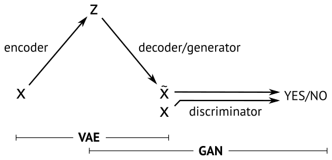

We train our GAN using aligned and cropped images from the [Labeled faces in the wild](http://vis-www.cs.umass.edu/lfw/) dataset.

After a few epochs (around 30 minutes on a GPU) you should start to see some spooky faces:

Which after 100 epochs will look a little less spooky

After a day of training, we get decent looking walks around in the latent space of the GAN:

[Movie](https://www.youtube.com/watch?v=PmC6ZOaCAOs&feature=youtu.be)

### Going Further
While it is good fun to generate images from noise, GANs gives us no control over the latent space.

A related generative model is the variational autoencoder (VAE)[3] in which the decoder maps samples from a prior distribution to dataset samples - very similar to GAN generator.

The VAE decoder is trained differently as we seek to minimize the pixelwise reconstruction error of the decoded image compared to the encoded image. This error term is problematic for images since translation is punished disproportionately to the small error perceived by human vision. In practice, this means that VAEs are biased towards generating smooth images with a correct global subject whereas GANs tend to produce images with correct local style with less emphasis on overall global structure.

Here’s an example of VAE reconstructions early in training:

We experimented with combining a VAE a GAN, basically we trained the model as VAE with the extra constraint that the images should fool the discriminator:    

**error = [GAN error] + [VAE reconstruction error]**

In our experiments the error was completely dominated by the VAE reconstruction term and we didn't see any improvement when comparing to a normal VAE. We then tried to pre-train a GAN and then use the generator as decoder in a VAE. The entire model was then trained using the error above. In this model we got best results by only training the bottom linear layer in the generator.

Below we show input images (left) that are run through the trained VAE-GAN model. The encoder maps each image to the latent space and the GAN then tries to reconstruct the input image (right). Because we have trained the model with the combined error term you can see that it (sometimes) manages to reconstruct the input images. These results are far from perfect and we see a lot of smoothing compared to pure GAN reconstructions. We see some interesting interpolation e.g. remove objects in front of faces like sun glasses, hands etc.

### Conclusion
GAN models are interesting because they generate realistic images but they are very tricky to train. In this blog post we have shown how to train a GAN to generate faces. Further experiments will show if GAN's can be combined with VAE and if they can be used in semi-supervised learning?

### Acknowledgements
Eyescream authors [2] for making their code public. Our code is heavily based on the CIFAR code released for the LAPGAN paper[2].
Torch VAE from Y0st: https://github.com/y0ast/VAE-Torch
