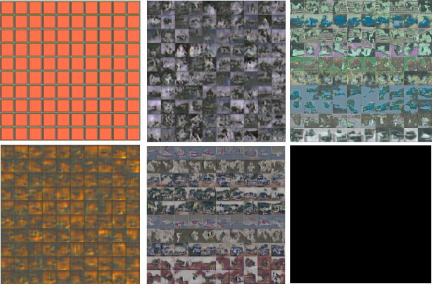
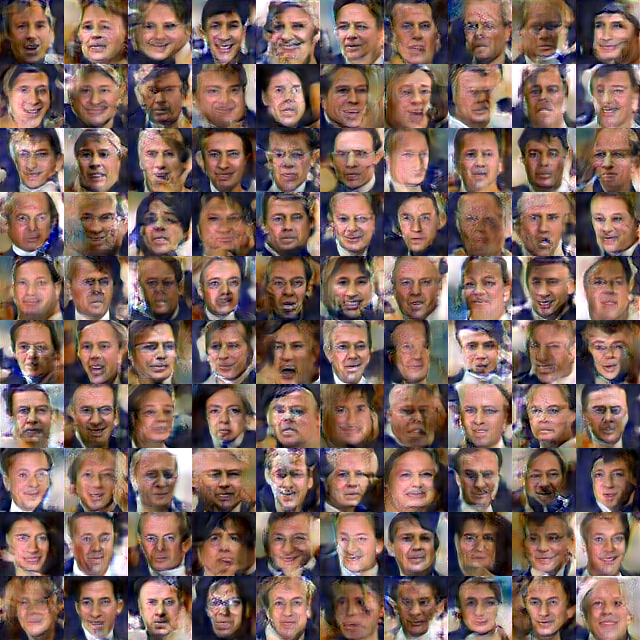

### Balancing the GAN game
In principle, the GAN optimization game is simple. We use binary cross entropy to optimize the parameters in the discriminator. Afterwards we use binary cross entropy to optimize the generator to fool the discriminator. However, you often find yourself left with not so convincing outputs from generator:



This gibberish is typical for a generator trained without proper care!

A couple of tricks are necessary to facilitate training: First of, we need to make sure that that neither the generator nor the discriminator becomes too good compared to the other. If the discriminator wins and classifies all images correctly, the error signal will be poor and the generator will not be able to learn from it. Conversely, if we allow the generator to win, it is usually exploiting a non-meaningful weakness in the discriminator (e.g. by coloring the entire image blue) which is not desirable.

We monitor the training by plotting three quantities:

  1. How good the generator is at at fooling the discriminator (gen)
  2. How good the discriminator is at classifying fakes as fakes (fake)
  3. how good the discriminator is at classifying real images as real (real)

 Below we plot these quantities for three different trainings.
 In panel A) we have batch normalization in the discriminator. The training does never converge because the discriminator is too good. In this case the sigmoid saturate and the generator will have no gradient.

 To alleviate the problem, we monitor how good the discriminator is at classifying real and fake images and how good the generator is at fooling the discriminator. If one of the networks is too good, we skip updating its parameters. This is shown in panel B). We also removed batch normalization from the discriminator.

 ```LUA
 local margin = 0.3
         sgdState_D.optimize = true
         sgdState_G.optimize = true
 if err_F < margin or err_R < margin then
         sgdState_D.optimize = false
 end
 if err_F > (1.0-margin) or err_R > (1.0-margin) then
         sgdState_G.optimize = false
 end
 if sgdState_G.optimize == false and sgdState_D.optimize == false then
         sgdState_G.optimize = true
         sgdState_D.optimize = true
 end
 ```
It seems a bit wasteful to not update the parameters in every batch. We tried another heuristic where we regularize the discriminator if the generator is not good enough. We increment the discriminators L2 penalty if the generator is not within a target range. If the generator fools the discriminator in 50% of the cases the error would be ~log(0.7) ~=0.69. We set the target range to be 0.9-1.2 i.e the discriminator should be better than the generator but not too much.
The training is shown in panel C) (Keep in mind that the x-axis is different)

```LUA
if f > 1.3 then  -- f is generator error
   sgdState_D.coefL2 = sgdState_D.coefL2 + 0.00001
end

if f < 0.9 then
   sgdState_D.coefL2 = sgdState_D.coefL2 - 0.00001
end

if sgdState_D.coefL2 < 0 then
   sgdState_D.coefL2 = 0
end
```

<p align='center'></p>

This simple heuristic seems to work, but there is definitely room for improvement. Most importantly, it allows us to crank up the learning rate and use RMSProp.

Secondly we found that batch normalization helps a lot when used in the generator. Using batch normalization in the discriminator did not help.

Also, plenty of dropout is needed in the discriminator to avoid oscillating behavior caused by the generator exploiting a weakness of the discriminator.

Finally, it may be beneficial to constrain the discriminator by decreasing its number of filters. We have found it best to let the generator contain more filters than the discriminator.

### Generating faces
We train our GAN using aligned and cropped images from the [Labeled faces in the wild](http://vis-www.cs.umass.edu/lfw/) dataset.

After a few epochs (around 30 minutes on a GPU) you should start to see some spooky faces:

<p align='center'></p>

Which after 100 epochs will look a little less spooky

<p align='center'></p>

After a day of training, we get decent looking walks around in the latent space of the GAN:


[Movie](https://www.youtube.com/watch?v=PmC6ZOaCAOs&feature=youtu.be)
